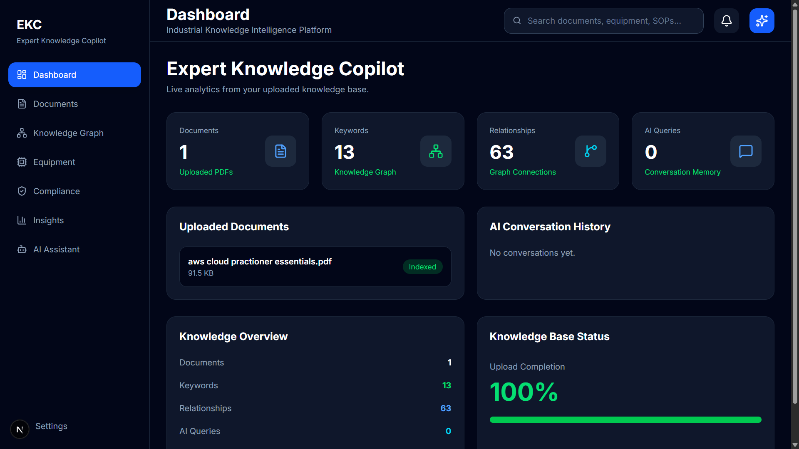
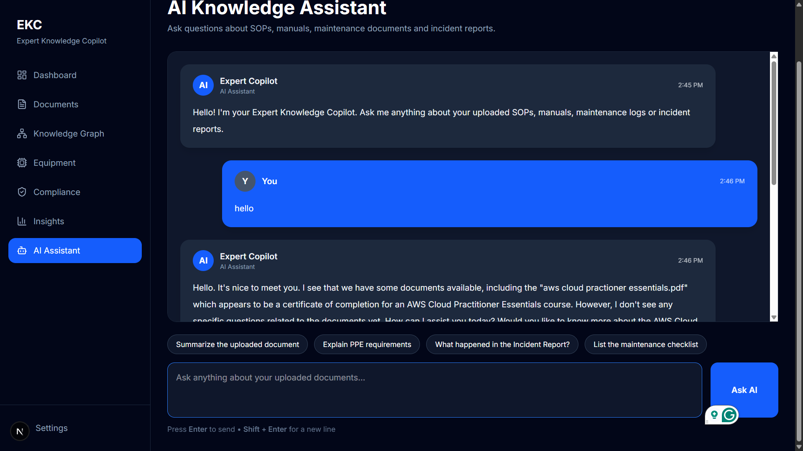
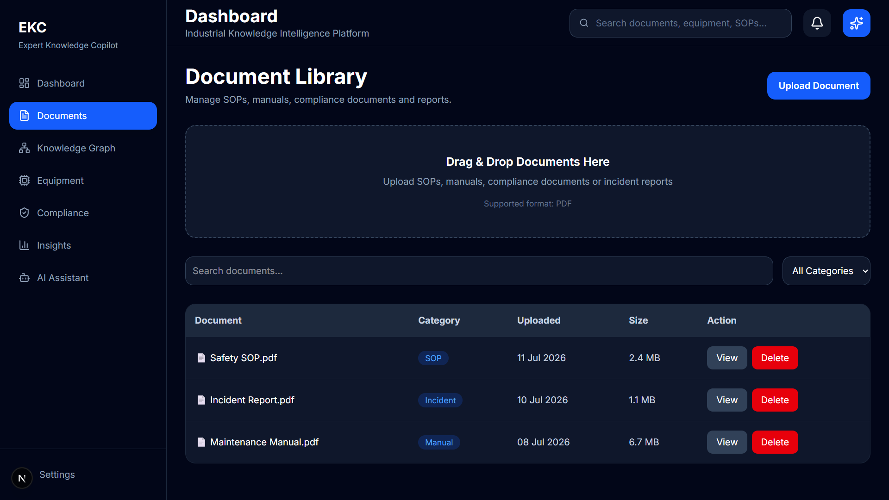
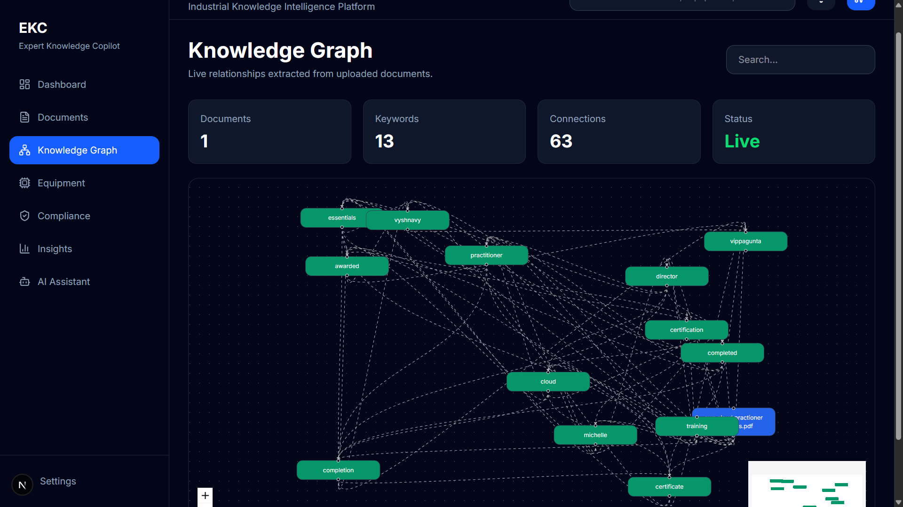

# Expert Knowledge Copilot

> An AI-powered enterprise knowledge management platform that enables intelligent document search, retrieval, summarization, comparison, and visualization using Retrieval-Augmented Generation (RAG) and Groq AI.

Built for the **ET Hackathon 2026**.

---

# Overview

Expert Knowledge Copilot helps organizations unlock valuable information hidden inside technical documents, SOPs, manuals, policies, reports, and compliance documents.

Instead of manually searching through hundreds of files, users can upload documents and ask questions in natural language. The platform retrieves the most relevant information using semantic search and generates accurate, context-aware responses powered by **Groq AI (Llama 3.3 70B)**.

---

# Features

## AI Copilot

- Natural language question answering
- Context-aware responses
- Conversation memory
- Source-backed answers

---

## Document Management

- Upload enterprise documents
- Automatic document processing
- Semantic indexing
- Vector storage

---

## Retrieval-Augmented Generation (RAG)

- Semantic similarity search
- Context retrieval
- AI-powered response generation

---

## AI Summarization

Generate concise summaries for:

- SOPs
- Technical Manuals
- Policies
- Reports

---

## Document Comparison

Compare multiple documents to identify:

- Similarities
- Differences
- Missing information
- Version changes

---

## Knowledge Graph

Visualize relationships between:

- Documents
- Topics
- Concepts
- Entities

---

## AI Insights

Automatically extract:

- Key findings
- Important entities
- Trends
- Recommendations

---

## Analytics Dashboard

Monitor:

- Uploaded documents
- AI activity
- Knowledge growth
- Search statistics

---

# Tech Stack

## Frontend

- Next.js
- React
- TypeScript
- Tailwind CSS
- shadcn/ui

---

## Backend

- FastAPI
- Python

---

## AI

- Groq API
- Llama 3.3 70B
- Sentence Transformers
- ChromaDB
- Retrieval-Augmented Generation (RAG)

---

# Project Structure

```text
expert-knowledge-copilot
│
├── app/
├── backend/
│   ├── app.py
│   ├── rag.py
│   ├── summarizer.py
│   ├── comparator.py
│   ├── analytics.py
│   ├── document_manager.py
│   ├── knowledge_graph.py
│   ├── insights.py
│   └── requirements.txt
│
├── components/
├── lib/
├── public/
└── README.md
```

---

# System Architecture

```text
                     User
                       │
                       ▼
             Next.js Frontend
                       │
                       ▼
               FastAPI Backend
                       │
        ┌──────────────┼──────────────┐
        ▼              ▼              ▼
 Document Parser   ChromaDB      Groq API
        │              │              │
        └──────────────┴──────────────┘
                       │
                       ▼
          Llama 3.3 70B Response
```

---

# Installation

## Clone the Repository

```bash
git clone https://github.com/sumavyshnavy/expert-knowledge-copilot.git

cd expert-knowledge-copilot
```

---

## Install Frontend

Install dependencies:

```bash
npm install
```

Run the development server:

```bash
npm run dev
```

Open:

```
http://localhost:3000
```

---

## Install Backend

Create a virtual environment:

```bash
python -m venv .venv
```

Activate it (Windows):

```bash
.venv\Scripts\activate
```

Install dependencies:

```bash
pip install -r backend/requirements.txt
```

Run the backend:

```bash
python backend/app.py
```

or

```bash
uvicorn backend.app:app --reload
```

---

# Environment Variables

Create a `.env` file inside the `backend` folder.

```env
GROQ_API_KEY=YOUR_GROQ_API_KEY
```

---

# Future Improvements

- Authentication
- Multi-user collaboration
- OCR support
- Cloud deployment
- Role-based permissions
- Multi-language document support
- Real-time document synchronization

---

# Developer

**ET Hackathon 2026**

Project: **Expert Knowledge Copilot**

Developed by:

**Suma Vyshnavy**

---

# Screenshots

## Dashboard


## AI Copilot


## Document Upload


## Compliance Dashboard


## Knowledge Graph


## Insights Dashboard


---

# License

MIT License

Developed for the **ET Hackathon 2026** using Groq AI and Retrieval-Augmented Generation (RAG).

This project is intended for educational, research, and demonstration purposes.
